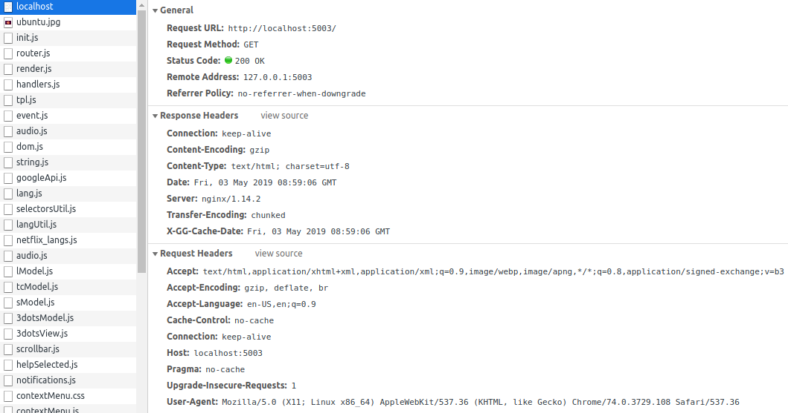
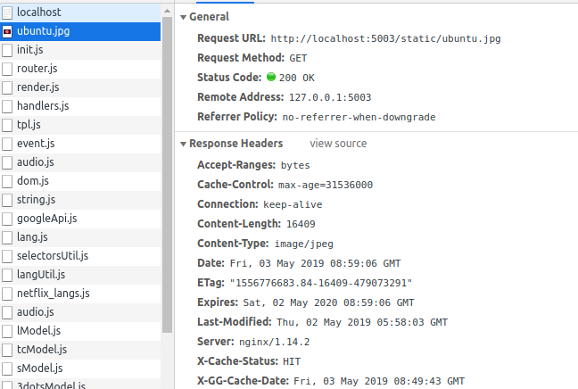
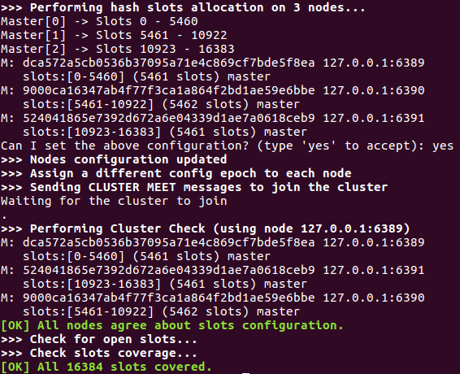
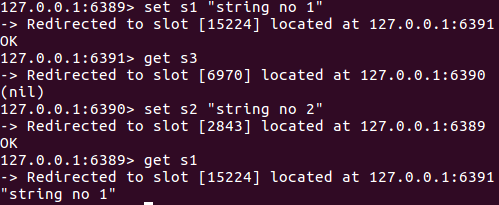

- [1. Lý thuyết](#1-lý-thuyết)    
    - [1.1. Định lý CAP](#11-định-lý-cap)    
    - [1.2. Khái niệm eventual consistency](#12-khái-niệm-eventual-consistency)
    - [1.3. Khái niệm throughput, latency](#13-khái-niệm-throughput-latency)   
    - [1.4. Các phương pháp để scale database (RDBMS)](#14-các-phương-pháp-để-scale-database-rdbms)        
        - [1.4.1. Replication](#141-replication)        
            - [1.4.1.1 Master-slave replication](#1411-master-slave-replication)  
            - [1.4.1.2. Master-master replication](#1412-master-master-replication) 
        - [1.4.2. Federation](#142-federation)        
        - [1.4.3. Sharding](#143-sharding)        
        - [1.4.4. Denormalization](#144-denormalization)    
    - [1.5. Message Queue vs. Task Queue?](#15-message-queue-vs-task-queue)    
        - [1.5.1. Message queues](#151-message-queues)        
        - [1.5.2. Task queues](#152-task-queues)
- [2. Bài tập](#2-bài-tập)    
    - [2.1. Load balancer](#21-load-balancer)        
        - [2.1.1. Khái niệm về Load balancer](#211-khái-niệm-về-load-balancer) 
            - [2.1.1.1. Layer 4 load balancing](#2111-layer-4-load-balancing)  
            - [2.1.1.2. Layer 7 load balancing](#2112-layer-7-load-balancing)  
            - [2.1.1.3. Horizontal scaling](#2113-horizontal-scaling)        
        - [2.1.2. Kiến trúc bên trong nginx](#212-kiến-trúc-bên-trong-nginx)   
        - [2.1.3. Tại sao nginx sử dụng single thread?](#213-tại-sao-nginx-sử-dụng-single-thread)        
        - [2.1.4. Thí nghiệm dùng nginx để load balancer 2 port](#214-thí-nghiệm-dùng-nginx-để-load-balancer-2-port)    
    - [2.2. Caching](#22-caching)        
        - [2.2.1. Vai trò của cache](#221-vai-trò-của-cache)            
            - [2.2.1.1. Client caching](#2211-client-caching)            
            - [2.2.1.2. CDN caching](#2212-cdn-caching)            
            - [2.2.1.3. Web server caching](#2213-web-server-caching)          
            - [2.2.1.4. Database caching](#2214-database-caching)            
            - [2.2.1.5. Application caching](#2215-application-caching)        
            - [2.2.1.6. Caching at the database query level](#2216-caching-at-the-database-query-level)            
            - [2.2.1.7. Caching at the object level](#2217-caching-at-the-object-level)            
            - [2.2.1.8. Chiến lược cập nhật cache](#2218-chiến-lược-cập-nhật-cache)           
        - [2.2.2. Các thuật toán apply của cache](#222-các-thuật-toán-apply-của-cache)
            - [2.2.2.1. First in first out (FIFO)](#2221-first-in-first-out-fifo) 
            - [2.2.2.2. Least recently used (LRU)](#2222-least-recently-used-lru) 
            - [2.2.2.3. Least-frequently used (LFU)](#2223-least-frequently-used-lfu)
        - [2.2.3. Sử dụng module cache cho nginx](#223-sử-dụng-module-cache-cho-nginx)
    - [2.3. Redis](#23-redis)        
        - [2.3.1. Kiến trúc bên trong Redis](#231-kiến-trúc-bên-trong-redis)   
            - [2.3.1.1 Key-Value Store](#2311-key-value-store)            
            - [2.3.1.2 Ưu điểm và nhược điểm của Redis so với DBMS](#2312-ưu-điểm-và-nhược-điểm-của-redis-so-với-dbms)            
            - [2.3.1.3. Redis Single Instance Architecture](#2313-redis-single-instance-architecture)            
            - [2.3.1.4. Redis Persistance](#2314-redis-persistance)            
            - [2.3.1.5. Backup và Recovery của Redis DataStore](#2315-backup-và-recovery-của-redis-datastore)            
            - [2.3.1.6. Redis Replication](#2316-redis-replication)            
            - [2.3.1.7. Clustering trong Redis](#2317-clustering-trong-redis)  
            - [2.3.1.8. Kết hợp Clustering và Replication](#2318-kết-hợp-clustering-và-replication)        
        - [2.3.2. Cấu trúc dữ liệu của Redis](#232-cấu-trúc-dữ-liệu-của-redis) 
        - [2.3.3. Khi nào dùng HyperLogLog?](#233-khi-nào-dùng-hyperloglog)    
        - [2.3.4. Cách đặt tên key trong Redis](#234-cách-đặt-tên-key-trong-redis)
        - [2.3.5. Config cluster redis 3 node, chạy cùng machine, khác port](#235-config-cluster-redis-3-node-chạy-cùng-machine-khác-port)        
        - [2.3.6. Chat application sử dụng Redis pub/sub (Java, Maven, Redisson)](#236-chat-application-sử-dụng-redis-pubsub-java-maven-redisson)
- [3. Nguồn tham khảo](#3-nguồn-tham-khảo)


-----------------------------------------


-----------------------------------------

# 1. Lý thuyết
## 1.1. Định lý CAP


Trong một hệ thống lưu trữ phân tán không thể đồng thời đảm bảo nhiều hơn hai trong ba tính chất sau:
- **Consistency** (tính nhất quán): Tất cả các thành phần của hệ thống đều có dữ liệu đồng nhất như nhau; Mỗi lần đọc dữ liệu sẽ nhận được nội dung mới nhất hoặc lỗi.
- **Availability** (tính sẵn có): Tất cả request tới hệ thống đều nhận được response, dù thành công hay thất bại, không đảm bảo rằng nó bao gồm phiên bản mới nhất của thông tin.
- **Partition Tolerance** (dung sai phân vùng): Hệ thống tiếp tục hoạt động bất chấp một lượng tùy ý các thông điệp/gói tin bị mất hoặc trì hoãn do trục trặc mạng giữa các node.

Mạng thì không phải lúc nào cũng ổn định, nên chúng ta cần tính chất Partition Tolerance, vì thế, phải đánh đổi 1 trong 2 tính chất Consistency hoặc Availability.

**CP - consistency and partition tolerance**
Chờ một response từ partitioned node có thể dẫn đến timeout error. CP là lựa chọn tốt nếu nhu cầu kinh doanh yêu cầu đọc và ghi ít.

**AP - availability and partition tolerance**
Responses trả về phiên bản gần nhất của dữ liệu có sẵn trên một node, có thể không phải là mới nhất. Việc ghi có lẽ sẽ mất một thời gian để  truyền khi partiton được giải quyết.

AP là lựa chọn tốt nếu nhu cầu kinh doanh cho phép eventual consistency (tính nhất quán cuối cùng) hoặc khi hệ thống cần tiếp tục hoạt động mặc dù có external errors.

## 1.2. Khái niệm eventual consistency
Sau khi thực hiện việc ghi, đến cuối cùng thì các lần đọc sẽ nhận thấy điều đó (thường trong vòng một phần nghìn giây). Dữ liệu được nhân bản bất đồng bộ.

Cách tiếp cận này được thấy trong các hệ thống như DNS và email. **Eventual consistency** hoạt động tốt trong các hệ thống có tính sẵn có cao.

## 1.3. Khái niệm throughput, latency
- **Latency** (độ trễ): thời gian để có được kết quả sau khi 1 công việc được thực hiện.

- **Throughput** (thông lượng): số lượng công việc hoặc kết quả thực hiện trên 1 đợn vị thời gian.

## 1.4. Các phương pháp để scale database (RDBMS)
Một cơ sở dữ liệu quan hệ như SQL là một tập hợp data items được tổ chức trong các bảng.

ACID là từ viết tắt các chữ cái đầu của bốn từ tiếng Anh atomicity, consistency, isolation, và durability. Chúng được coi là bốn thuộc tính quan trọng của một hệ quản trị cơ sở dữ liệu khi xử lý bất kỳ transaction (giao dịch) nào. Nếu thiếu một trong những thuộc tính này thì tính toàn vẹn của cơ sở dữ liệu khó có thể được đảm bảo. Trong một hệ quản trị cơ sở dư liệu, một transaction là một đơn vị logic thao tác trên dữ liệu, có thể bao gồm nhiều thao tác. Chẳng hạn việc chuyển tiền từ tài khoản này sang tài khoản khác là một giao dịch, bao gồm thao tác trừ tiền một tài khoản và cộng tiền vào tài khoản kia. Các tính chất ACID trong trường hợp này sẽ đảm bảo các giao dịch được thực hiện một cách đáng tin cậy:
- **Atomicity** (Tính nguyên tố) - Một giao dịch có nhiều thao tác khác biệt thì hoặc là toàn bộ các thao tác hoặc là không một thao tác nào được hoàn thành. Chẳng hạn việc chuyển tiền có thể thành công hay trục trặc vì nhiều lý do nhưng tính nguyên tố bảo đảm rằng một tài khoản sẽ không bị trừ tiền nếu như tài khoản kia chưa được cộng số tiền tương ứng.
- **Consistency** (Tính nhất quán) - Một giao dịch hoặc là sẽ tạo ra một trạng thái mới và hợp lệ cho dữ liệu, hoặc trong trường hợp có lỗi sẽ chuyển toàn bộ dữ liệu về trạng thái trước khi thực thi giao dịch.
- **Isolation** (Tính độc lập) - Một giao dịch đang thực thi và chưa được xác nhận phải bảo đảm tách biệt khỏi các giao dịch khác.
- **Durability** (Tính bền vững) - Dữ liệu được xác nhận sẽ được hệ thống lưu lại sao cho ngay cả trong trường hợp hỏng hóc hoặc có lỗi hệ thống, dữ liệu vẫn đảm bảo trong trạng thái chuẩn xác.

Có nhiều kỹ thuật để mở rộng cơ sở dữ liệu quan hệ: master-slave replication, master-master replication, federation, sharding, denormalization và SQL tuning.
### 1.4.1. Replication
### 1.4.1.1 Master-slave replication
Master phục vụ đọc và ghi, nhân bản các bản ghi tới một hoặc nhiều slaves - chỉ phục vụ đọc. Slaves cũng có thể nhân bản thành slaves bổ sung theo kiểu giống như cây. Nếu master offline, hệ thống có thể tiếp tục hoạt động ở chế độ chỉ đọc cho đến khi một slave được thăng cấp thành master hoặc master mới được cung cấp.


**Nhược điểm: master-slave replication**
- Cần bổ sung nhiều xử lý logic để chuyển một slave thành một master.

### 1.4.1.2. Master-master replication
Cả hai masters phục vụ đọc, ghi và phối hợp với nhau làm việc với các bản ghi. Nếu một trong hai master bị hỏng, hệ thống có thể tiếp tục hoạt động phục vụ cả đọc và ghi.


**Nhược điểm: master-master replication**
- Ta sẽ cần một bộ load balancer (cân bằng tải) hoặc sẽ cần thay đổi xử lý logic ứng dụng của mình để xác định nơi để thực hiện ghi.
- Hầu hết các master-master system đều có tính nhất quán lỏng lẻo (vi phạm ACID) hoặc tăng độ trễ xử lý ghi do việc đồng bộ hóa.
- Giải quyết đụng độ xuất hiện nhiều hơn khi nhiều node ghi được thêm vào và khi độ trễ tăng lên.

**Nhược điểm chung: replication**
- Có khả năng mất dữ liệu nếu master bị lỗi trước khi bất kỳ dữ liệu mới nào được ghi có thể được nhân bản sang các node khác.
- Các bản ghi được phát lại thành các bản sao để đọc. Nếu có nhiều bản ghi, các bản sao để đọc có thể bị sa lầy với các bản ghi phát lại và không thể thực hiện nhiều lần đọc.
- Càng nhiều slaves chỉ đọc, càng phải nhân bản nhiều hơn, điều này dẫn đến replication lag lớn hơn.
- Trên một số hệ thống, ghi vào master có thể sinh ra nhiều luồng để ghi song song, trong khi bản sao để đọc chỉ hỗ trợ ghi tuần tự với một luồng.
- Replication cần bổ sung nhiều phần cứng và dẫn đến độ phức tạp tăng.

### 1.4.2. Federation


Federation hay functional partitioning (phân vùng chức năng) phân chia cơ sở dữ liệu theo chức năng. 

Ví dụ: thay vì một cơ sở dữ liệu nguyên khối duy nhất, có thể có ba cơ sở dữ liệu: forums, users và products, dẫn đến lưu lượng cho đọc và ghi ít hơn vào mỗi cơ sở dữ liệu và do đó replication lag ít hơn. Nó cho phép ghi song song bằng cách gia tăng thông lượng.

**Nhược điểm: federation**
- Federation không hiệu quả nếu schema yêu cầu các chức năng hoặc bảng lớn.
- Cần cập nhật xử lý logic cho ứng dụng của mình để xác định cơ sở dữ liệu nào cần đọc và ghi.
- Join dữ liệu từ hai cơ sở dữ liệu phức tạp hơn vì phải server link.
- Federation cần bổ sung nhiều phần cứng và dẫn đến độ phức tạp tăng.

### 1.4.3. Sharding


Sharding phân phối dữ liệu trên các cơ sở dữ liệu khác nhau sao cho mỗi cơ sở dữ liệu chỉ có thể quản lý một tập hợp con của dữ liệu. 

Lấy cơ sở dữ liệu User làm ví dụ, khi số lượng người dùng tăng lên, nhiều phân đoạn (shards) được thêm vào cụm (cluster). Các cách phổ biến để phân đoạn bảng người dùng là thông qua tên họ của người dùng hoặc vị trí địa lý của người dùng.

Tương tự như các ưu điểm của federation, sharding dẫn đến lưu lượng đọc và ghi ít hơn, nhân bản ít hơn và nhiều lần truy cập bộ đệm hơn. Kích thước chỉ mục cũng được giảm, điều này thường cải thiện hiệu suất với các truy vấn nhanh hơn. Nếu một phân đoạn bị hỏng, các phân đoạn khác vẫn hoạt động, mặc dù ta sẽ muốn thêm một số hình thức nhân bản để tránh mất dữ liệu. Giống như federation, nó cho phép ghi song song bằng cách gia tăng thông lượng.

**Nhược điểm: sharding**
- Cần cập nhật xử lý logic cho ứng dụng của mình để làm việc với các phân đoạn, điều này có thể dẫn đến các truy vấn SQL phức tạp.
- Phân phối dữ liệu có thể trở nên chậm chạp trong một phân đoạn. Ví dụ, một nhóm power users trên phân đoạn có thể dẫn đến tăng tải cho phân đoạn đó so với những người dùng khác.
- Join dữ liệu từ nhiều phân đoạn phức tạp hơn.
- Sharding cần bổ sung nhiều phần cứng và dẫn đến độ phức tạp tăng.

### 1.4.4. Denormalization
Các bản sao dự phòng của dữ liệu được ghi trong nhiều bảng để tránh join tốn kém. Một số RDBMS như PostgreSQL và Oracle hỗ trợ materialized views xử lý công việc lưu trữ thông tin dự phòng và giữ các bản sao dự phòng nhất quán.

Khi dữ liệu được phân phối với các kỹ thuật như federation and sharding, việc quản lý join giữa các data centers sẽ tăng thêm độ phức tạp. Denormalization có thể tránh được sự cần thiết của các phép join phức tạp như vậy.

Trong hầu hết các hệ thống, số lần đọc có thể vượt quá số lượng ghi 100:1 hoặc thậm chí 1000:1. Một lần đọc dẫn đến việc join cơ sở dữ liệu phức tạp có thể rất tốn kém, tiêu tốn một lượng thời gian đáng kể cho các hoạt động trên đĩa.

**Nhược điểm: denormalization**
- Dữ liệu bị nhân đôi.
- Các ràng buộc có thể giúp các bản sao thông tin dự phòng được đồng bộ hóa, điều này làm tăng sự phức tạp của thiết kế cơ sở dữ liệu.
- Một cơ sở dữ liệu không chuẩn hóa (denormalized database) không nặng việc ghi có thể hoạt động kém hơn so với bản chuẩn hóa (normalized).

## 1.5. Message Queue vs. Task Queue?


### 1.5.1. Message queues
**Message queues** nhận, giữ và phân phối messages. Nếu một thao tác quá chậm không thể thực hiện inline (nội tuyến), có thể sử dụng message queue với quy trình làm việc sau:
- Một ứng dụng đưa một công việc vào hàng đợi, sau đó thông báo cho người dùng về trạng thái công việc
- Một worker nhận công việc từ hàng đợi, xử lý nó, sau đó báo hiệu công việc đã hoàn thành

Người dùng không bị chặn và công việc được xử lý trong background. Trong thời gian này, client có thể tùy ý thực hiện một số lượng nhỏ xử lý để làm cho có vẻ như nhiệm vụ (task) đã được hoàn thành. Ví dụ: nếu đăng một tweet, tweet có thể được đăng ngay lập tức lên dòng thời gian, nhưng có thể mất một thời gian trước khi tweet đó thực sự được gửi đến tất cả những người theo dõi.

**Redis** thì hữu ích như một trung gian message đơn giản nhưng message có thể bị mất.
**RabbitMQ** thì phổ biến nhưng yêu cần phải thích nghi với giao thức 'AMQP' và quản lý các node của riêng ta.
**Amazon SQS** được dùng nhiều nhưng có thể có độ trễ cao và có khả năng message được gửi hai lần.

### 1.5.2. Task queues
**Task queues** nhận task (nhiệm vụ) và dữ liệu liên quan, chạy chúng, sau đó cung cấp kết quả. Chúng có thể hỗ trợ lập lịch và có thể được sử dụng để xử lý các công việc chuyên sâu tính toán trong background.

**Celery** có hỗ trợ lập lịch và chủ yếu hỗ trợ python.

# 2. Bài tập 
## 2.1. Load balancer
### 2.1.1. Khái niệm về Load balancer 


**Load balancers** (các cân bằng tải) phân phối requests của client đến computing resources như application servers và databases. Trong mỗi trường hợp, bộ cân bằng tải trả về response từ computing resource cho client thích hợp. Cân bằng tải có tác dụng:
- Ngăn chặn requests đến server yếu
- Ngăn chặn overloading resources
- Giúp loại bỏ single points of failure (SPOF là một phần của hệ thống, nếu nó fail, sẽ ngăn toàn bộ hệ thống hoạt động. SPOF là không mong muốn trong bất kỳ hệ thống nào với mục tiêu có tính sẵn có hoặc độ tin cậy cao)
Cân bằng tải có thể được implement với phần cứng (đắt tiền) hoặc bằng phần mềm như HAProxy.

**Các chức năng bổ sung bao gồm:**
- **SSL termination** - Giải mã requests đến và mã hóa responses của server để backend servers không phải thực hiện các hoạt động tốn kém này
- **Session persistence** - Định tuyến các requests của một client cụ thể  và cấp cookies nếu web apps không theo dõi sessions

Để chống lại sự cố, thông thường phải thiết lập nhiều bộ cân bằng tải, ở chế độ active-passive or active-active.
Cân bằng tải có thể định tuyến lưu lượng dựa trên các số liệu khác nhau, bao gồm:
- Random
- Least loaded
- Session/cookies
- Round robin or weighted round robin
- Layer 4
- Layer 7

**Nhược điểm: load balancer**
- Bộ cân bằng tải có thể gây performance bottleneck (tắc nghẽn hiệu năng) nếu nó không có đủ resources hoặc nếu nó không được cấu hình đúng.
- Đem vào bộ cân bằng tải giúp loại bỏ single points of failure results dẫn đến gia tăng độ phức tạp.
- Một bộ cân bằng tải đơn là một single point of failure, cấu hình nhiều bộ cân bằng tải làm tăng thêm độ phức tạp.

#### 2.1.1.1. Layer 4 load balancing
Layer 4 load balancers xem xét thông tin ở transport layer để quyết định cách phân phối requests. Nói chung, điều này liên quan đến các địa chỉ IP nguồn, đích và ports trong header, nhưng không liên quan đến các nội dung (contents) của packet. Layer 4 load balancers chuyển tiếp netword packets đến và từ upstream server, thực hiện Network Address Translation (NAT).

#### 2.1.1.2. Layer 7 load balancing
Layer 7 load balancers xem xét application layer để quyết định cách phân phối requests. Điều này có thể liên quan đến contents của header, message và cookies. Layer 7 load balancers chấm dứt lưu lượng mạng, đọc message, đưa ra quyết định cân bằng tải, sau đó mở kết nối đến server được chọn. Ví dụ: một layer 7 load balancer có thể hướng lưu lượng video đến servers lưu trữ video trong khi hướng lưu lượng thanh toán của người dùng nhạy cảm hơn đến servers được tăng cường bảo mật.

Với chi phí linh hoạt, layer 4 load balancing đòi hỏi ít thời gian và tài nguyên máy tính hơn layer 7, mặc dù tác động hiệu suất có thể là tối thiểu đối với phần cứng hiện đại.

#### 2.1.1.3. Horizontal scaling
Cân bằng tải cũng có thể giúp mở rộng theo chiều ngang, cải thiện hiệu suất và tính sẵn có. Mở rộng quy mô bằng cách sử dụng các máy móc có chi phí cao hơn và mang lại tính sẵn có cao hơn so với việc nhân bản một server duy nhất trên phần cứng đắt tiền hơn, được gọi là mở rộng theo chiều dọc (Vertical Scaling). Việc thuê người giỏi làm việc trên phần cứng cũng dễ dàng hơn so với các hệ thống doanh nghiệp chuyên biệt.

**Nhược điểm: horizontal scaling**
- Mở rộng quy mô theo chiều ngang đem đến sự phức tạp và liên quan đến cloning servers
    - Máy chủ không trạng thái: chúng không được chứa bất kỳ dữ liệu nào liên quan đến người dùng như sessions hoặc profile pictures
    - Sessions có thể được lưu trữ trong kho lưu trữ dữ liệu tập trung như database (SQL, NoSQL) hoặc persistent cache (Redis, Memcached)
- Downstream servers như caches và databases cần xử lý nhiều kết nối đồng thời hơn khi upstream servers mở rộng

### 2.1.2. Kiến trúc bên trong nginx
**Bên trong NGINX**


**NGINX** sử dụng predictable process model (mô hình dự đoán tiến trình) được điều chỉnh theo tài nguyên phần cứng có sẵn:
- Master process thực hiện các thao tác đặc quyền như reading configuration và binding to ports, và sau đó tạo một lượng nhỏ các child processes (3 loại kế tiếp).
- Cache loader process chạy khi khởi động để tải disk-based cache vào memory (bộ nhớ), rồi thoát. Nó được lập lịch một cách bảo thủ, do đó nhu cầu tài nguyên của nó thấp.
- Cache manager process chạy định kỳ và cắt các entry từ disk caches để giữ chúng trong kích thước được cấu hình. 
- Worker processes làm tất cả các công việc! Chúng xử lý các kết nối mạng, đọc và ghi nội dung vào đĩa và giao tiếp với các upstream servers.


**Bên trong NGINX Worker Process**


Mỗi NGINX worker process được khởi tạo với NGINX configuration và được cung cấp một tập listen sockets bởi master process.

Các NGINX worker processes bắt đầu bằng cách chờ đợi các sự kiện trên listen sockets (accept_mutex và kernel socket sharding). Các sự kiện được khởi tạo bởi các kết nối mới đến. Các kết nối này được gán cho một state machine (HTTP state machine được sử dụng phổ biến nhất), nhưng NGINX cũng triển khai các state machines cho stream (raw TCP) traffic và cho một số mail protocols (SMTP, IMAP, and POP3).


State machine về cơ bản là tập hợp các hướng dẫn (set of instructions) cho NGINX biết cách xử lý một request. Hầu hết các web servers thực hiện các chức năng tương tự NGINX đều sử dụng state machine tương tự - sự khác biệt nằm ở cách triển khai.

**Blocking vs. Non-Blocking**
- Blocking: các dòng lệnh được thực hiện tuần tự, dòng lệnh phía trước chưa hoàn thành thì dòng lệnh phía sau chưa được thực hiện.
- Non-Blocking: Về mặt logic, nếu dòng lệnh phía sau không phụ thuộc vào kết quả của dòng lệnh phía trước, thì nó cũng có thể được thực hiện ngay sau khi dòng lệnh trước được gọi mà không cần đợi tới khi kết quả được sinh ra. Đi theo mỗi dòng lệnh thường có đoạn mã callback sẽ thực hiện ngay sau khi có kết quả trả về từ dòng lệnh không đồng bộ.

**State Machine**

***Blocking State Machine***


1. Web server process lắng nghe các kết nối mới trên các listen sockets.
2. Khi có kết nối mới, nó chấp nhận kết nối, thực thi các tác vụ read/write và đợi sau mỗi lần thực hiện để chờ phản hồi của client.
3. Khi hoàn tất, web server process có thể chờ xem client có muốn bắt đầu một kết nối mới không (điều này tương ứng với keepalive connection). Nếu kết nối bị đóng (client biến mất hoặc hết thời gian chờ), web server process sẽ quay trở lại để lắng nghe các kết nối mới.

***Non-Blocking State Machine***


1. Worker chờ đợi các sự kiện trên listen và connection sockets.
2. Các sự kiện xảy ra trên các sockets và worker xử lý chúng:
- Một sự kiện trên listen socket nghĩa là client đã bắt đầu một kết nối. Worker tạo một connection socket mới.
- Một sự kiện trên connection socket nghĩa là client đã thực hiện một tác vụ. Worker phản hồi kịp thời.

**NGINX sử dụng Non-Blocking State Machine**

### 2.1.3. Tại sao nginx sử dụng single thread?
- Mỗi worker process là một single-thread và chạy độc lập, lấy các kết nối mới và xử lý chúng. Các processes có thể giao tiếp bằng bộ nhớ dùng chung cho dữ liệu đệm chung, dữ liệu lưu giữ phiên và các tài nguyên được chia sẻ khác.

- Thông thường, các webserver sẽ tạo 1 thread cho mỗi kết nối và thực hiện block khi có I/O. Trong khi nginx sử dụng cơ chế Non-Blocking, vì thế nên khi có tác vụ I/O, thread sẽ chuyển sang xử lý kết nối khác, khi tác vụ I/O hoàn tất sẽ có lệnh callback để thread quay lại xử lý tiếp.

- Vậy nếu so với multiple thread thì sao? Cách thực hiện của nginx vẫn tỏ ra hiệu quả hơn vì dùng multiple thread blocking I/O thì do phần nhiều thời gian xử lý kết nối là tác vụ I/O nên cứ tạo 1 thread cho mỗi kết nối thì cũng phải block để chờ I/O, tốn kém tài nguyên cho việc context switch.

### 2.1.4. Thí nghiệm dùng nginx để load balancer 2 port
**"Hello World" python webpage**
1. Cài đặt python3 và python3-pip
2. Cài đặt python3-venv
3. Tạo thư mục `my_flask_app` và cd vào rồi nhập lệnh `python3 -m venv venv`
4. Kích hoạt môi trường ảo: `source venv/bin/activate`
5. Cài đặt Flask: `pip install Flask`
6. Tạo file `hello.py`

```python
from flask import Flask
app = Flask(__name__)
 
@app.route("/")
def hello():
    return "Hello World!"
 
if __name__ == "__main__":
    app.run()
```

7. Chạy lệnh dưới để có web trên port 5001 (mặc định là port 5000):

`export FLASK_APP=hello`

`flask run --port 5001`

**Run web với 2 port**
Ta muốn chạy 2 cùng 1 web trong 2 port 5001 và 5002 thì chỉ việc mở 2 terminal:
- Terminal 1:

`export FLASK_APP=hello`

`flask run --port 5001`

- Terminal 2:

`export FLASK_APP=hello`

`flask run --port 5002`

Nếu muốn thì có thể code file `hello.py` sao cho chạy 2 thread để mở web trên 2 port!!!

**Load balancer cho 2 port**
1. Cài đặt nginx và ufw

`sudo apt update`

`sudo apt install nginx`

`sudo apt-get install ufw`

2. Set up default polocies

`sudo ufw default deny incoming`

`sudo ufw default allow outgoing`

3. Enable ufw

`sudo ufw enable`

4. Allow 'Nginx HTTP'

`sudo ufw allow 'Nginx HTTP'`

5. Kiểm tra lại status ufw:

`sudo ufw status`

6. Nhận được kết quả như dưới đây là thành công:

```
Status: active

To                         Action      From
--                         ------      ----
OpenSSH                    ALLOW       Anywhere                  
Nginx HTTP                 ALLOW       Anywhere                  
OpenSSH (v6)               ALLOW       Anywhere (v6)             
Nginx HTTP (v6)            ALLOW       Anywhere (v6)
```

6. Config nginx: Có 2 cách để config nginx là sửa trực tiếp file `nginx.conf` hoặc include file config của mình vào. Ta chọn cách 2:
- Tạo file `load-balancer.conf` (đặt tên tùy ý) với nội dung:

```
upstream backend  {
    server localhost:5001;
    server localhost:5002;
}

server {
    listen 5003;
    location / {
    proxy_pass  http://backend;
    }
}
```

Có nghĩa là nginx sẽ lắng nghe tại port 5003, sau đó load balancing tới 2 localhost có port là 5001 và 5002 (đang chạy `hello.py`)

- Vào config của nginx:

`cd /etc/nginx`

`sudo nano nginx.conf`

- Tìm section có dạng `http { ... }`
- Ghi dòng `include /path/to/load-balancer.conf` vào trong section để include file config vào section đó (đường dẫn tùy nơi lưu file config của bạn).
- Save lại.
7. Reload

`sudo systemctl restart nginx`

`sudo systemctl reload nginx`

8. Test ở browser
- Khi ta nhập url: `localhost:5003` thì nó sẽ trả về `Hello World!` webpage
- Quan sát 2 terminal mở webpage với 2 port ta thấy nó truy cập ngẫu nhiên vào 1 trong 2.
- Cứ thế F5 reload lại url `localhost:5003` và xem kết quả ở terminal.

## 2.2. Caching
### 2.2.1. Vai trò của cache


Caching (Bộ đệm) cải thiện thời gian tải trang và có thể giảm tải cho servers và databases. Trong mô hình trên, dispatcher (điều phối) trước tiên sẽ tra cứu nếu request đã được thực hiện trước đó và cố gắng tìm kết quả trước đó để trả về, để lưu thực thi hiện thời.

Cơ sở dữ liệu thường được hưởng lợi từ việc phân phối đọc và ghi thống nhất trên các phân vùng của nó. Các item phổ biến có thể làm lệch phân phối, gây ra tắc nghẽn. Đặt một bộ đệm trước cơ sở dữ liệu có thể giúp hấp thu tải không đồng đều và tăng đột biến trong lưu lượng.

**Nhược điểm: cache**
- Cần duy trì tính nhất quán giữa bộ nhớ đệm và source như cơ sở dữ liệu thông qua việc vô hiệu hóa bộ đệm (cache invalidation).
- Vô hiệu hóa bộ đệm là một vấn đề khó khăn, có thêm sự phức tạp khi cập nhật bộ đệm.
- Cần thực hiện các thay đổi ứng dụng như thêm Redis hoặc memcached.

#### 2.2.1.1. Client caching
Caches có thể được đặt ở phía client (OS hoặc browser), phía server hoặc trong một cache layer riêng biệt.

#### 2.2.1.2. CDN caching
Content delivery network (CDN) là một mạng lưới proxy servers phân tán toàn cầu, phục vụ nội dung từ các địa điểm gần hơn với người dùng. Nói chung, các tệp tĩnh như HTML/CSS/JS, ảnh và video được cung cấp từ CDN, mặc dù một số CDN như CloudFront của Amazon hỗ trợ nội dung động. Sự phân giải DNS của trang web sẽ cho clients biết nên liên hệ với server nào.

Phục vụ nội dung từ CDN có thể cải thiện đáng kể hiệu suất theo hai cách:
- Người dùng nhận nội dung tại data centers gần với họ.
- Servers không phải phục vụ requests mà CDN thi hành.

**Push CDNs**
Push CDNs nhận nội dung mới bất cứ khi nào có thay đổi trên server. Ta chịu trách nhiệm hoàn toàn về việc cung cấp nội dung, tải trực tiếp lên CDN và viết lại URLs để trỏ đến CDN. Ta có thể cấu hình khi nội dung hết hạn và khi nội dung được cập nhật. Nội dung chỉ được tải lên khi nó mới hoặc thay đổi, giảm thiểu lưu lượng, nhưng tối đa hóa lưu trữ.

Các trang web có lưu lượng truy cập nhỏ hoặc các trang web có nội dung không thường được cập nhật hoạt động tốt với push CDNs. Nội dung được đặt trên CDN một lần, thay vì bị kéo về lại theo định kỳ.

**Pull CDNs**
Pull CDNs lấy nội dung mới từ server khi người dùng đầu tiên request nội dung. Ta để lại nội dung trên server của mình và viết lại URLs để trỏ đến CDN. Điều này dẫn đến một request chậm hơn cho đến khi nội dung được lưu trữ trên CDN.

Thời gian tồn tại (TTL) xác định thời gian lưu trữ nội dung. Pull CDNs giảm thiểu không gian lưu trữ trên CDN, nhưng có thể tạo lưu lượng dư nếu tệp hết hạn và được kéo về trước khi chúng thực sự thay đổi.

Các trang web có lưu lượng truy cập lớn hoạt động tốt với pull CDNs, vì lưu lượng truy cập được trải đều hơn chỉ với nội dung được request gần đây còn lại trên CDN.

**Nhược điểm: CDN**
- Chi phí cho CDN có thể đáng kể tùy thuộc vào lưu lượng truy cập, mặc dù điều này nên được cân nhắc với chi phí bổ sung mà ta sẽ gánh khi không sử dụng CDN.
- Nội dung có thể đã cũ nếu nó được cập nhật trước khi TTL hết hạn.
- CDNs yêu cầu thay đổi URLs cho nội dung tĩnh để trỏ đến CDN.

**CDN được coi là một loại bộ đệm.**

#### 2.2.1.3. Web server caching
")

Reverse proxy là một web server tập trung các dịch vụ nội bộ và cung cấp unified interfaces cho công khai. Requests từ clients được chuyển tiếp đến một server có thể thực hiện nó trước khi reverse proxy trả về response của server cho client.

Reverse proxies và caches như Varnish có thể phục vụ nội dung tĩnh và động trực tiếp. Web servers cũng có thể lưu trữ đệm các request, trả lời các response mà không phải liên hệ với application servers.

#### 2.2.1.4. Database caching
Cơ sở dữ liệu thường bao gồm một số mức bộ nhớ đệm trong cấu hình mặc định, được tối ưu hóa cho trường hợp sử dụng chung. Tinh chỉnh các cài đặt này cho các usage patterns cụ thể có thể tăng thêm hiệu suất.

#### 2.2.1.5. Application caching
In-memory caches như Memcached và Redis là lưu trữ key-value giữa ứng dụng (application) và bộ lưu trữ dữ liệu (data storage). Vì dữ liệu được giữ trong RAM, nó nhanh hơn nhiều so với cơ sở dữ liệu thông thường nơi dữ liệu được lưu trữ trên đĩa. RAM bị giới hạn nhiều hơn so với đĩa, do đó, các thuật toán vô hiệu hóa bộ đệm (cache invalidation algorithms) như được sử dụng gần đây nhất (LRU) có thể giúp vô hiệu hóa 'cold' entries và giữ 'hot' data trong RAM.

Redis có các tính năng sau:
- Persistence option
- Các cấu trúc dữ liệu tích hợp như: sorted sét và lists

Có nhiều cấp độ để có thể lưu vào bộ nhớ đệm, thuộc hai loại: database queries và objects:
- Row level
- Query-level
- Fully-formed serializable objects
- Fully-rendered HTML

Nói chung cần tránh file-based caching, vì nó làm cho việc nhân bản và tự động mở rộng trở nên khó khăn hơn.

#### 2.2.1.6. Caching at the database query level
Bất cứ khi nào truy vấn cơ sở dữ liệu, hãy băm truy vấn dưới dạng khóa và lưu kết quả vào bộ đệm. Cách tiếp cận này bị các vấn đề hết hạn:
- Khó xóa kết quả lưu trữ đệm với các truy vấn phức tạp
- Nếu một phần dữ liệu thay đổi, chẳng hạn như một ô của bảng, ta cần xóa tất cả các truy vấn được lưu trong bộ nhớ đệm có thể bao gồm ô đã thay đổi

#### 2.2.1.7. Caching at the object level
Xem dữ liệu dưới dạng đối tượng, tương tự như những gì ta làm với application code của mình. Yêu cầu ứng dụng tập hợp dữ liệu từ cơ sở dữ liệu vào một thể hiện của lớp hoặc cấu trúc dữ liệu:
- Xóa đối tượng khỏi bộ đệm nếu dữ liệu cơ bản của nó đã thay đổi
- Cho phép xử lý bất đồng bộ: workers tập hợp các đối tượng bằng cách hủy đối tượng lưu trữ mới nhất

Gợi ý những gì cần lưu trữ đệm:
- User sessions
- Fully rendered web pages
- Activity streams
- User graph data

#### 2.2.1.8. Chiến lược cập nhật cache
Vì ta chỉ có thể lưu trữ một lượng dữ liệu hạn chế trong bộ đệm, nên sẽ cần xác định chiến lược cập nhật bộ đệm nào hoạt động tốt nhất cho trường hợp sử dụng.

##### 2.2.1.8.1. Cache-aside


Ứng dụng (application) chịu trách nhiệm đọc và ghi từ bộ lưu trữ. Bộ nhớ đệm không tương tác trực tiếp với bộ lưu trữ. Ứng dụng này thực hiện như sau:
- Tìm kiếm entry trong bộ đệm, nếu chưa được chứa trong bộ nhớ đệm (dẫn đến cache miss)
- Load entry từ cơ sở dữ liệu
- Thêm entry vào cache
- Trả về entry

```
    def get_user(self, user_id):
        user = cache.get("user.{0}", user_id)
        if user is None:
            user = db.query("SELECT * FROM users WHERE user_id = {0}", user_id)
            if user is not None:
                key = "user.{0}".format(user_id)
                cache.set(key, json.dumps(user))
        return user
```

Memcached thường được sử dụng theo cách này.

Việc đọc dữ liệu sau đó được thêm vào bộ đệm thì rất nhanh. Cache-aside cũng được gọi là lazy loading. Chỉ dữ liệu được request là được lưu vào bộ nhớ đệm, giúp tránh đầy bộ đệm bởi dữ liệu không được request.

**Nhược điểm: cache-aside**
- Mỗi lần cache miss, điều này có thể gây ra sự chậm trễ .
- Dữ liệu có thể trở nên cũ nếu nó đã được cập nhật trong cơ sở dữ liệu. Vấn đề này được giảm thiểu bằng cách đặt thời gian tồn tại (TTL) để cập nhật cache entry hoặc bằng cách sử dụng write-through.
- Khi một node fail, nó được thay thế bằng một node rỗng mới, làm tăng độ trễ.

##### 2.2.1.8.2. Write-through


Ứng dụng sử dụng bộ đệm làm kho lưu trữ dữ liệu chính, đọc và ghi dữ liệu vào nó, trong khi bộ đệm có trách nhiệm đọc và ghi vào cơ sở dữ liệu:
- Ứng dụng thêm/cập nhật entry trong bộ đệm
- Bộ nhớ đệm ghi entry vào bộ lưu trữ dữ liệu (data store) một cách đồng bộ
- Trả về

Application code:

```
    set_user(12345, {"foo":"bar"})
```

Cache code:

```
    def set_user(user_id, values):
    user = db.query("UPDATE Users WHERE id = {0}", user_id, values)
    cache.set(user_id, user)
```

Write-through là một hoạt động tổng thể chậm do hoạt động ghi, nhưng các lần đọc tiếp theo của dữ liệu đã được ghi thì nhanh. Người dùng thường chấp nhận độ trễ khi cập nhật dữ liệu hơn là đọc dữ liệu. Dữ liệu trong bộ đệm không cũ.

**Nhược điểm: write through**
- Khi một nút mới được tạo do lỗi hoặc mở rộng, nút mới sẽ không lưu đệm các entry cho đến khi entry được cập nhật trong cơ sở dữ liệu. Cache-aside kết hợp với write through có thể giảm thiểu vấn đề này.
- Hầu hết các dữ liệu được ghi có thể không bao giờ được đọc, có thể được giảm thiểu bằng một TTL.

##### 2.2.1.8.3. Write-behind (write-back)


Trong write-behind, ứng dụng thực hiện như sau:
- Thêm/cập nhật entry vào cache
- Ghi bất đồng bộ entry vào kho lưu trữ dữ liệu, cải thiện hiệu suất ghi

**Nhược điểm: write-behind**
- Có thể bị mất dữ liệu nếu bộ đệm bị hỏng trước khi nội dung của nó đụng vào kho lưu trữ dữ liệu.
- Việc triển khai write-behind sẽ phức tạp hơn so với thực hiện cache-aside hoặc write-through.

##### 2.2.1.8.4. Refresh-ahead


Có thể cấu hình bộ đệm tự động refresh bất kỳ cache entry nào được truy cập gần đây trước khi nó hết hạn.

Refresh-ahead có thể làm giảm độ trễ so với read-through nếu bộ đệm có thể dự đoán chính xác những item nào có thể cần thiết trong tương lai.

**Nhược điểm: refresh-ahead**
- Không dự đoán chính xác những item nào có khả năng cần thiết trong tương lai có thể làm hiệu suất giảm hơn so với không refresh-ahead.

### 2.2.2. Các thuật toán apply của cache
#### 2.2.2.1. First in first out (FIFO)
Sử dụng thuật toán này, bộ đệm hoạt động theo cách tương tự như hàng đợi FIFO. Bộ đệm sẽ trục xuất block đầu tiên được truy cập trước mà không liên quan đến tần suất hoặc số lần truy cập trước đó.

#### 2.2.2.2. Least recently used (LRU)
Item ít được sử dụng gần đây thì bị loại bỏ đầu tiên khỏi bộ đệm.

#### 2.2.2.3. Least-frequently used (LFU)
Item có tần suất sử dụng ít nhất thì bị loại bỏ đầu tiên khỏi bộ đệm.

### 2.2.3. Sử dụng module cache cho nginx
**Làm python webpage hiện ảnh tĩnh local**
1. Cài đặt python3 và python3-pip
2. Cài đặt python3-venv
3. Tạo thư mục `my_flask_app` và cd vào rồi nhập lệnh `python3 -m venv venv`
4. Kích hoạt môi trường ảo: `source venv/bin/activate`
5. Cài đặt Flask: `pip install Flask`
6. Vào thư mục `my_flask_app`, tạo thư mục `image-web`
7. Vào thư mục `image-web`, tạo 2 thư mục và 1 file python:
- `static` : chứa file ảnh tĩnh, ở đây tôi dùng ảnh `ubuntu.jpg`
- `templates` : chứa file index.html có nội dung: 

```html
<!DOCTYPE html PUBLIC "-//IETF//DTD HTML 2.0//EN">
<HTML>
   <HEAD>
      <TITLE>
         Ubuntu 
      </TITLE>
   </HEAD>
<BODY>
   <P></P>
</BODY>
</HTML>
```

- `image.py` 

```python
from flask import Flask, render_template
import os

app = Flask(__name__)

@app.route('/')
def index():
    return render_template('index.html')

if __name__ == '__main__':
    app.run()
```

8. Test web trên port 5000

`export FLASK_APP=image`

`flask run --port 5000`

**Cài đặt nginx**
1. Cài đặt nginx và ufw

`sudo apt update`

`sudo apt install nginx`

`sudo apt-get install ufw`

2. Set up default polocies

`sudo ufw default deny incoming`

`sudo ufw default allow outgoing`

3. Enable ufw

`sudo ufw enable`

4. Allow 'Nginx HTTP'

`sudo ufw allow 'Nginx HTTP'`

5. Kiểm tra lại status ufw:

`sudo ufw status`

6. Nhận được kết quả như dưới đây là thành công:

```
Status: active

To                         Action      From
--                         ------      ----
OpenSSH                    ALLOW       Anywhere                  
Nginx HTTP                 ALLOW       Anywhere                  
OpenSSH (v6)               ALLOW       Anywhere (v6)             
Nginx HTTP (v6)            ALLOW       Anywhere (v6)
```

**Kích hoạt module cache của nginx để lưu đệm ảnh**
1. Tạo thư mục chứa cache cho nginx và cấp quyền

`cd /var/cache`

`sudo mkdir nginx`

`sudo chmod -x nginx`

2. Tạo file `cache.conf` chứa config để cache

```
proxy_cache_path /var/cache/nginx levels=1:2 keys_zone=my_cache:10m max_size=10g 
                 inactive=60m use_temp_path=off;

server {
    listen 5003;
    add_header X-Cache-Status $upstream_cache_status;
    add_header X-GG-Cache-Date $upstream_http_date;
    location / {
        proxy_ignore_headers Cache-Control;
        proxy_pass http://localhost:5000;
        
    }
    location ~* \.(jpg|jpeg|png|gif|ico)$ {
        proxy_cache my_cache;
        proxy_cache_valid any 30m;
        proxy_cache_use_stale error timeout http_500 http_502 http_503 http_504;
        expires 365d;
        proxy_pass http://localhost:5000;
    }
}
```

- Config này quy định cache sẽ lưu tại /var/cache/nginx
- Nginx lắng nghe tại port 5003
- Nginx sẽ chuyển tới localhost:5000 (nơi có trang web ảnh tĩnh)
- Nó chỉ cache các file có đuôi jpg. jpeg. png. gif, ico
- Thời hạn lưu là 365 ngày.

3. Include file trên vào `nginx.conf`
- Vào config của nginx:

`cd /etc/nginx`

`sudo nano nginx.conf`

- Tìm section có dạng `http { ... }`
- Ghi dòng `include /path/to/cache.conf` vào trong section để include file config vào section đó (đường dẫn tùy nơi lưu file config của bạn).
- Save lại.

4. Reload lại nginx

`sudo systemctl restart nginx`

`sudo systemctl reload nginx`

5. Chắc chắn rằng để chạy web ảnh tĩnh trên port 5000
6. Test module cache trên browser:
- Chuột phải -> Inspect -> Network, ta Disable cache của browser
- Load url localhost:5003
- Quan sát header
    - local host


    - File ảnh tĩnh (ở đây ảnh của tôi là ubuntu.jpg)


    - Thấy rằng X-Cache-Status: **HIT**

## 2.3. Redis
### 2.3.1. Kiến trúc bên trong Redis
#### 2.3.1.1 Key-Value Store
Key-Value Store là một hệ thống lưu trữ nơi dữ liệu được lưu trữ dưới dạng các cặp key-value (khóa và giá trị). Khi chúng ta nói in-memory key-value store, điều đó có nghĩa là các cặp key-value được lưu trữ trong primary memory (RAM). Vì vậy, chúng ta có thể nói rằng Redis lưu trữ dữ liệu trong RAM dưới dạng các cặp key-value.

#### 2.3.1.2 Ưu điểm và nhược điểm của Redis so với DBMS
**Ưu điểm**
Database Management systems lưu trữ mọi thứ trong second storage làm cho hoạt động đọc và ghi rất chậm. Nhưng Redis lưu trữ mọi thứ trong primary memory (bộ nhớ sơ cấp) nên rất nhanh trong việc đọc và ghi dữ liệu.

**Nhược điểm**
Primary memory bị giới hạn (kích thước nhỏ hơn và đắt hơn nhiều so với secondary memory) do đó Redis không thể lưu trữ large files hoặc binary data. Nó chỉ có thể lưu trữ những thông tin văn bản nhỏ mà cần được truy cập, sửa đổi và thêm với tốc độ rất nhanh. Nếu chúng ta cố gắng ghi nhiều dữ liệu hơn bộ nhớ khả dụng thì chúng ta sẽ nhận được lỗi.

#### 2.3.1.3. Redis Single Instance Architecture


Kiến trúc Redis gồm 2 main processes: Redis client và Redis server.

Redis client và server có thể có thể ở cùng một máy tính hoặc ở hai máy tính khác nhau.

Redis server chịu trách nhiệm lưu trữ dữ liệu trong bộ nhớ. Nó xử lý tất cả các loại quản lý và tạo ra phần chính của kiến trúc. Redis client có thể là Redis console client hoặc Redis API của bất kỳ ngôn ngữ lập trình nào khác.

Như chúng ta đã thấy rằng Redis lưu trữ mọi thứ trong primary memory. Primary memory thì lưu trữ tạm thời và do đó chúng ta sẽ mất tất cả dữ liệu được lưu trữ sau khi chúng ta khởi động lại Redis server hoặc máy tính. Vì vậy, chúng ta cần một cách để datastore persistance (lưu trữ dữ liệu bền vững).

#### 2.3.1.4. Redis Persistance
**RDB Mechanism**
RDB tạo ra bảo sao của tất cả dữ liệu trong bộ nhớ và lưu trữ chúng trong secondary storage (bộ nhớ thứ cấp) hay permanent storage (bộ nhớ vĩnh viễn)

**AOF**
AOF ghi log lại tất cả các thao tác ghi mà server nhận được. Do đó mọi thứ đều ghi nhớ lâu dài. Vấn đề với việc sử dụng AOF là nó ghi vào đĩa cho mọi hoạt động và nó là một việc tốn kém và kích thước của tệp AOF lớn hơn tệp RDB.

**SAVE Command**
Có thể buộc redis server tạo RDB snapshot bất cứ lúc nào bằng cách thông qua redis console client sử dụng lệnh SAVE command.

Có thể sử dụng AOF và RDB cùng nhau để có kết quả tốt nhất.

#### 2.3.1.5. Backup và Recovery của Redis DataStore
Redis không cung cấp bất kỳ cơ chế nào để sao lưu và phục hồi kho dữ liệu. Do đó, nếu có bất kỳ sự cố đĩa cứng hoặc bất kỳ loại sự cố nào khác thì tất cả dữ liệu sẽ bị mất. Bạn cần sử dụng một số phần mềm backup và recovery của third party server để khắc phục nó.

#### 2.3.1.6. Redis Replication


Replication (nhân bản) là một kỹ thuật liên quan đến kết nối nhiều máy tính để cho phép khả năng chịu lỗi và khả năng truy cập dữ liệu. Trong hệ thống này, nhiều máy tính chia sẻ cùng một dữ liệu với nhau để ngay cả khi có vài máy tính bị hỏng, tất cả dữ liệu sẽ có sẵn.

#### 2.3.1.7. Clustering trong Redis


Clustering (phân cụm) là một kỹ thuật mà dữ liệu có thể được sharded (divided - phân chia) ra nhiều máy tính.

Trong hình trên, chúng ta có thể thấy dữ liệu được chia thành bốn nút. Mỗi nút là một redis server được cấu hình như một cluster node.

Nếu mội node fail thì tất cả các cluster dừng hoạt động.

#### 2.3.1.8. Kết hợp Clustering và Replication


Giả sử do đĩa bị crash, một trong các node của chúng ta bị hỏng sau đó toàn bộ cluster ngừng hoạt động và không bao giờ hoạt động trở lại. Không có cách nào để chúng ta có thể khôi phục lại node vì dữ liệu bị mất hoàn toàn.

Ở đây chúng ta chuyển đổi mỗi node server thành một master server. Và chúng ta giữ một slave cho mọi server. Vì vậy, nếu bất kỳ node (master) nào fail, cluster sẽ bắt đầu sử dụng slave để giữ cho cluster hoạt động.

### 2.3.2. Cấu trúc dữ liệu của Redis
**String**

| Câu lệnh | Chức năng |
| :------: |:---------:|
| GET | Lấy giá trị value của key |
| SET | Thiết lập giá trị cho key |
| DEL | Xóa key và giá trị tương ứng |

**List**
List trong Redis là linked list, lưu trữ 1 danh sách có thứ tự (trước sau) của các string.

| Câu lệnh | Chức năng |
| :------: |:---------:|
| RPUSH | Cho thêm 1 giá trị vào phía bên phải của list |
| LRANGE | Lấy 1 dải giá trị của list |
| LINDEX | Lấy ra phần tử của list dựa theo index |
| LPOP | Lấy ra giá trị ở phái ngoài cùng bên trái của list và xóa giá trị đó đi |

**Set**
Set trong Redis khá giống với list, nhưng khác 1 điều là các phần tử trong set không được sắp xếp theo thứ tự nào cả. Redis dùng hash table (bảng băm) nên các chuỗi không trùng nhau.

| Câu lệnh | Chức năng |
| :------: |:---------:|
| SADD | Add thêm 1 phần tử vào set |
| SMEMBERS | Lấy ra tất cả các phần tử của set |
| SISMEMBER | Check xem 1 phần tử có tồn tại trong set hay không |
| SREM | Xóa đi 1 phần tử của set (nếu nó tồn tại) |

**Hash**
HASH lưu trữ tập các map của key và value. Key vẫn là string, còn value có thể là string hoặc số.

| Câu lệnh | Chức năng |
| :------: |:---------:|
| HSET | Thêm 1 cặp key-value vào hash hoặc thay đổi giá trị của key đã có. |
| HGET | Lấy giá trị của key trong hash có sẵn |
| HGETALL | Lấy ra tất cả các phần tử của hash |
| HDEL | Xóa cặp key-value ra khỏi hash (nếu key tồn tại) |

**Sorted Set**
Sorted Set (ZSET) là 1 phiên bản đầy đủ của set, khi mà phần value của item được thiết lập, và bắt buộc là 1 số (float number) được gọi là score. Ở điểm này thì zset khá giống với hash khi lưu trữ 1 cặp key, value (trong zset gọi là member và score). Và vì là “sorted”, nên các cặp member-score được add vào sorted set sẽ được sắp xếp theo thứ tự của các score, nếu score trùng nhau thì tiếp tục sắp xếp theo member. Ngoài ra cũng cần chú ý là không cho phép 2 phần tử khác nhau của zset có member trùng nhau.

| Câu lệnh | Chức năng |
| :------: |:---------:|
| ZADD | Thêm 1 phần tử vào tập hợp với score của nó |
| ZRANGE | Lấy ra các phần tử của tập hợp theo vị trí của chúng trong zset |
| ZRANGEBYSCORE | Lấy ra các phần tử của tập hợp theo phạm vi của score |
| ZREM | Xóa 1 phần tử khỏi tập hợp (nếu nó tồn tại) |

**HyperLogLog**
HyperLogLog (HLL) là một cấu trúc dữ liệu xác suất được sử dụng để đếm các giá trị duy nhất.

Các giá trị này có thể là bất cứ điều gì: ví dụ như địa chỉ IP cho khách truy cập của trang web, cụm từ tìm kiếm hoặc địa chỉ email.

| Câu lệnh | Chức năng |
| :------: |:---------:|
| PFADD | Thêm phần tử vào HLL |
| PFCOUNT | Đếm số lượng các giá trị duy nhất của HLL |
| PFMERGE | Gộp các HLL lại với nhau |

Ví dụ:

```
> PFADD visitors alice bob carol
(integer) 1
> PFCOUNT visitors
(integer) 3
> PFADD customers alice dan
(integer) 1
> PFMERGE everyone visitors customers
OK
> PFCOUNT everyone
(integer) 4
> PFCOUNT visitors customers
(integer) 4
```


### 2.3.3. Khi nào dùng HyperLogLog?
Một ví dụ về trường hợp sử dụng cho cấu trúc dữ liệu HyperLogLog là đếm các unique queries (truy vấn duy nhất) được thực hiện bởi users trong biểu mẫu search form mỗi ngày.

### 2.3.4. Cách đặt tên key trong Redis
Redis keys ở dạng nhị nhân, có thể sử dụng chuỗi nhị phân làm key, có thể là string, có thể là nội dung của một JPEG file. Empty string cũng là key hợp lệ.
- Không dùng key quá dài. Ví dụ như key 1024 bytes sẽ gây lãng phí bộ nhớ và truy vấn tốn kém. Các key lớn nên băm nó (SHA1, ...)
- Không dùng key quá ngắn. Thêm một ít không gian bộ nhớ để giúp key rõ ràng hơn thì không tốn đáng kể. Key quá ngắn sẽ khó hiểu.
- Key nên theo cấu trúc sau: "object-type:id". Ví dụ: "user:1000". Dấu '.' hoặc dấu '-' thường dùng cho các trường có nhiều từ. Ví dụ: "comment:2000:repley.to" hoặc "comment:2000:reply-to".
- Kích thước tối đa của key là 512 MB.

### 2.3.5. Config cluster redis 3 node, chạy cùng machine, khác port
1. Tải và cài đặt Redis.
2. Vào thư mục chứa Redis, chạy redis-server bằng lệnh: `src/redis-server`
3. Tham khảo mô hình redis 3 node sau:


- Tuy nhiên, thay vì dùng 3 port 6379, 6380, 6381 thì ta sẽ dùng 3 port 6389. 6390. 6391 để tránh trùng port 6379 với redis-server. 
- Bạn cũng có thể dùng 3 port bất kỳ miễn là port đó chưa bị chiếm.

4. Ta sẽ tạo thư mục mô tả 3 node theo mô hình này:
- Tại thư mục cài Redis, tạo thư mục `cluster-3-node`, bên trong tạo thêm 3 thư mục tương ứng 3 node với 3 port khác nhau.

```
mkdir cluster-3-node
cd cluster-3-node
mkdir 6389 6390 6391
```

5. Tiến hành config:
- Vào thư mục `6389` tạo 2 file config a_master và c_slave tương ứng với mô hình trên để nội nội dung config.

```
cd 6389
touch a_master.conf c_slave.conf
```

- Nội dung config của a_master.conf (port 6379):

```
port 6389
cluster-enabled yes
daemonize yes
cluster-config-file nodes-6389.conf
cluster-node-timeout 5000
appendonly yes
```

- Nội dung config của c_slave.conf (vì c_slave là slave của c_master nên có port 6381):

```
port 6391
cluster-enabled yes
daemonize yes
cluster-config-file nodes-6391.conf
cluster-node-timeout 5000
appendonly yes
```

- Tương tự với 2 node còn lại.

| Server |  Master  | Slave |
| :----: | :------: | :---: |
| 1 | 6389 | 6391 |
| 2 | 6390 | 6389 |
| 3 | 6391 | 6390 |

6. Kết nối master và slave lại với nhau
- Với node 6389:

```
src/redis-server cluster-3-node/6389/a_master.conf
src/redis-server cluster-3-node/6389/c_slave.conf
```

- Tương tự với 2 node còn lại.

7. Tạo cluster

```
src/redis-cli --cluster create 127.0.0.1:6389 127.0.0.1:6390 127.0.0.1:6391
```



- Nhập yes và các master sẽ được phân cụm riêng biệt!

**Lưu ý:** Quá trình tạo cluster bị lỗi có thể tham khảo các link sau:

https://github.com/antirez/redis/issues/3154
https://stackoverflow.com/questions/37206993/redis-server-cluster-not-working

8. Thử truy cập 1 node

```
src/redis-cli -c -h 127.0.0.1 -p 6389
```


    
### 2.3.6. Chat application sử dụng Redis pub/sub (Java, Maven, Redisson)
1. Cài đặt Java: https://www3.ntu.edu.sg/home/ehchua/programming/howto/JDK_Howto.html

2. Cài đặt IntelliJ IDEA Community: chắc chắn rằng IDEA đã nhận đường dẫn Java

3. Tạo 1 Maven Project

4. Import Redisson 3.10.7 (Latest version currently)
- Tại file pom.xml, Code -> Generate... -> Dependency Template
- Import Redisson

```
<dependency>
    <groupId>org.redisson</groupId>
    <artifactId>redisson</artifactId>
    <version>3.10.7</version>
</dependency>
```

5. Khởi động redis-server: Vào thư mục chứ redis, terminal: `src/redis-server`. Nhớ là redis-server của ta ở localhost:6379
6. Code thôi!!! Muốn console hay GUI đều được. Sau đây là một vài gợi ý để code:
- Java Configuration: 

```java
Config config = new Config();
config.useSingleServer()
  .setAddress("redis://127.0.0.1:6379");
 
RedissonClient client = Redisson.create(config);
```

- Redisson hỗ trợ redis pub/sub
    - SUBSCRIBE sẽ lắng nghe tới 1 chanel

```java
RTopic subscribeTopic=client.getTopic("chanel");
subscribeTopic.addListener(CustomMessage.class, new MessageListener<CustomMessage>() {

    public void onMessage(CharSequence charSequence, CustomMessage customMessage) {
    //output
    }
});
```

    - PUBLISH cho phép ta push message vào 1 chanel

```java
RTopic publishTopic=client.getTopic(chanel);
publishTopic.publish(customMessage);
```

    - Với `CustomMessage` là class do mình định nghĩ, có thể sử dụng class do java hỗ trợ như: `String`. 

- Redisson cũng có nhiều class hỗ trợ lưu dữ liệu trong cache có thể set thời hạn sống như: RMapCache, RListMultimapCache,...


# 3. Nguồn tham khảo
- Blocking và Non-Blocking: https://codersontrang.wordpress.com/2017/09/05/blocking-va-non-blocking-trong-lap-trinh/
- NGINX: https://dzone.com/articles/inside-nginx-how-we-designed
- Redis Architecture: http://qnimate.com/overview-of-redis-architecture/
- Redis data types: https://viblo.asia/p/redis-data-types-and-commands-ZK1ov1n1R5b9
- Hyperloglog: https://thoughtbot.com/blog/hyperloglogs-in-redis
- Config cluster Redis 3 node: https://www.linode.com/docs/applications/big-data/how-to-install-and-configure-a-redis-cluster-on-ubuntu-1604/